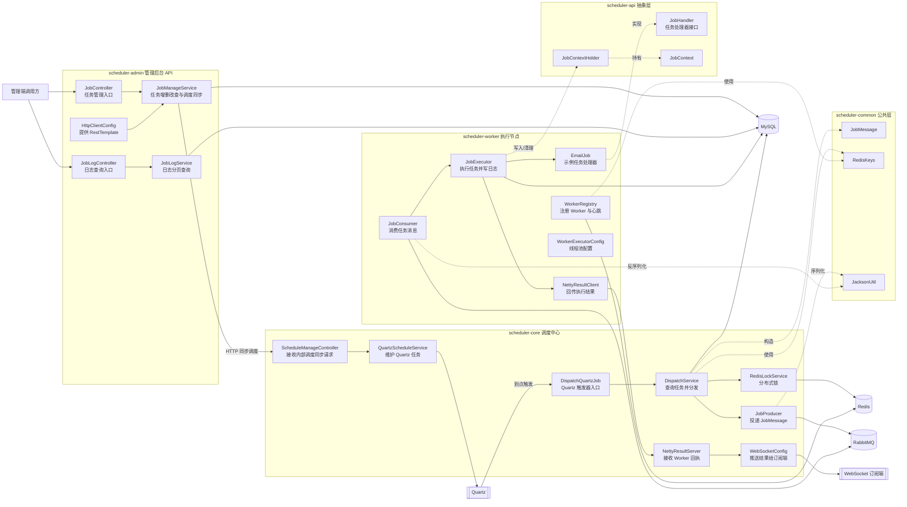
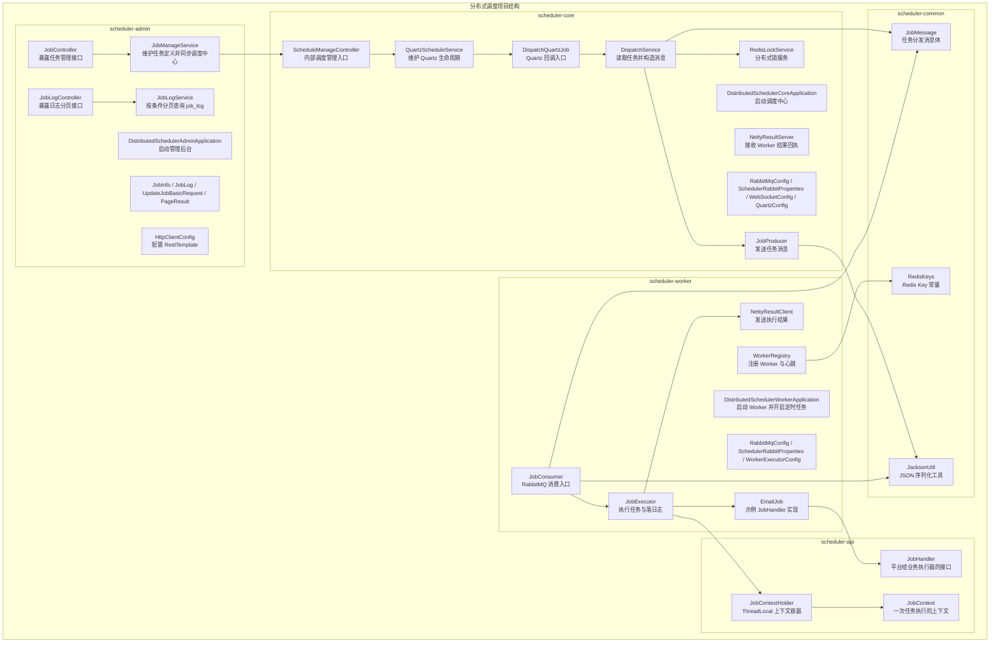
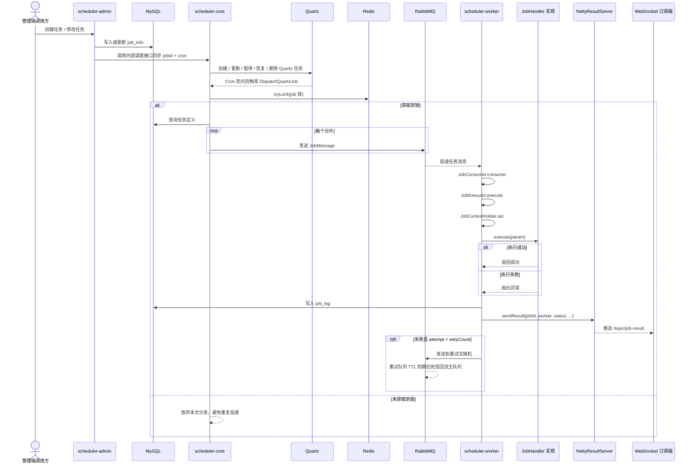
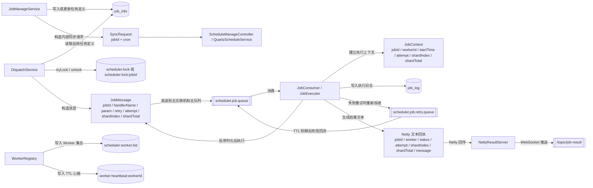

# 分布式调度项目图解与源码讲解

这是一套 `scheduler-admin -> scheduler-core -> scheduler-worker` 分层的分布式调度系统，外部依赖为 MySQL、Redis、RabbitMQ、Quartz、Netty、WebSocket。

## 1. 项目框架图

### 框架图说明

- `scheduler-admin` 是控制面入口，负责把任务定义写入 MySQL，并通过内部 HTTP 请求通知调度中心刷新 Quartz 状态。
- `scheduler-core` 是调度中心，负责接收管理端同步请求、维护 Quartz、通过 Redis 锁避免重复分发、通过 RabbitMQ 推送任务、通过 Netty 接收执行结果、通过 WebSocket 广播执行反馈。
- `scheduler-worker` 是执行面，负责向 Redis 注册心跳、从 RabbitMQ 取任务、按 `handlerName` 找到 `JobHandler` 实现类并执行，然后写入执行日志并回传结果。
- `scheduler-api` 提供调度平台与业务执行器之间的抽象契约，核心是 `JobHandler` 和运行时上下文。
- `scheduler-common` 提供跨模块共享的数据对象和工具类，保障消息结构、Redis key 命名、JSON 序列化方式在各模块之间保持一致。

## 2. 项目结构图

### 结构图说明

- 这个项目不是按单体分层拆包，而是按职责拆成 5 个 Maven 模块。
- `scheduler-admin` 只关心任务定义和执行日志，不承担真正的调度与执行。
- `scheduler-core` 只关心“什么时候触发”和“如何把任务发出去”，不真正执行业务逻辑。
- `scheduler-worker` 只关心“把消息变成真实执行”，不参与 Cron 维护。
- `scheduler-api` 与 `scheduler-common` 是复用层，一个负责抽象契约，一个负责共享对象。

## 3. 项目流程图

### 流程图说明

- 任务的创建和变更都从 `JobManageService` 开始，它先把任务定义写入 `job_info`，再决定是否通知调度中心同步 Quartz。
- `ScheduleManageController` 接到内部请求后，会把操作转交给 `QuartzScheduleService`，由它决定是创建新任务、更新触发器、暂停任务、恢复任务还是删除任务。
- 真正到 Cron 触发时，是 `DispatchQuartzJob.execute` 被 Quartz 调用，然后它把 `jobId` 交给 `DispatchService.dispatch(jobId)`。
- `DispatchService` 在发消息之前会先通过 `RedisLockService.tryLock` 拿按任务粒度的锁，避免同一任务在多个调度节点重复分发。
- `DispatchService` 根据 `shardTotal` 循环构造多个 `JobMessage`，再调用 `JobProducer.send` 推入 RabbitMQ。
- `JobConsumer.consume` 是 Worker 侧的 RabbitMQ 消费入口，它负责消息校验、反序列化、调用执行器、失败重试投递。
- `JobExecutor.execute` 会把当前执行信息写入 `JobContextHolder`，从 Spring 容器中按 `handlerName` 找到 `JobHandler` 实现类并执行，然后在 `finally` 中统一写 `job_log` 并触发结果回传。
- `NettyResultServer` 收到 Worker 的结果文本后，不做二次持久化，而是直接通过 WebSocket 广播给订阅端。

## 4. 项目运行时数据链路图

### 数据链路说明

- `job_info` 是任务定义表，保存任务名称、Cron、处理器名、参数、状态、重试次数、超时时间、分片总数等元信息。
- `job_log` 是执行日志表，由 Worker 在任务执行结束后写入，每次执行都会记录所属任务、执行节点、开始时间、结束时间、状态和消息。
- Redis 中至少承担了 3 类数据：调度锁、Worker 集合、Worker 心跳。
- `JobMessage` 是调度中心和 Worker 之间的核心载体，包含任务标识、处理器名、参数、重试次数、当前尝试次数、当前分片号、总分片数。
- `JobContext` 是 Worker 内部的运行时上下文，不会跨网络传输，它只在当前线程里为执行器提供本次任务的元信息。
- Worker 的回执不是对象协议，而是一个格式化后的文本字符串，`NettyResultClient` 负责发送，`NettyResultServer` 负责接收，接收到后直接转发到 `/topic/job-result`。

## 5. 对外接口、内部接口与关键类型

### 管理端 HTTP 接口

| 接口 | 入口类与方法 | 作用 |
| --- | --- | --- |
| `POST /api/jobs` | `JobController.create` | 新增任务定义并在启用状态下同步 Quartz |
| `GET /api/jobs` | `JobController.list` | 查询任务列表 |
| `PUT /api/jobs/{id}/status` | `JobController.changeStatus` | 启停任务，并通知调度中心暂停或恢复 |
| `PUT /api/jobs/{id}/cron` | `JobController.changeCron` | 修改 Cron，并在任务启用时同步调度中心 |
| `PUT /api/jobs/{id}/basic` | `JobController.updateBasic` | 修改任务名称、处理器名、参数、重试次数、超时、分片总数 |
| `DELETE /api/jobs/{id}` | `JobController.delete` | 删除任务定义，并通知调度中心删除 Quartz 任务 |
| `GET /api/job-logs` | `JobLogController.page` | 按任务 ID、时间范围、分页参数查询执行日志 |

### 调度中心内部 HTTP 接口

| 接口 | 入口类与方法 | 作用 |
| --- | --- | --- |
| `POST /internal/schedules/sync` | `ScheduleManageController.sync` | 校验 `jobId` 和 `cron` 后调用 `QuartzScheduleService.scheduleOrUpdate` |
| `POST /internal/schedules/{jobId}/pause` | `ScheduleManageController.pause` | 暂停指定 Quartz 任务 |
| `POST /internal/schedules/{jobId}/resume` | `ScheduleManageController.resume` | 恢复指定 Quartz 任务 |
| `POST /internal/schedules/{jobId}/delete` | `ScheduleManageController.delete` | 删除指定 Quartz 任务 |

### 实时推送接口

| 接口 | 配置类 | 作用 |
| --- | --- | --- |
| `/ws/scheduler` | `WebSocketConfig.registerStompEndpoints` | 提供 STOMP 连接入口 |
| `/topic/job-result` | `WebSocketConfig.configureMessageBroker` | 推送 Worker 执行结果文本 |

### 扩展接口

| 接口 | 作用 | 当前实现方式 |
| --- | --- | --- |
| `JobHandler.execute(String param)` | 业务方真正编写任务逻辑的扩展点 | `JobExecutor` 从 Spring 容器中读取全部 `JobHandler` Bean，再用 `handlerName` 找到目标实现 |

### 关键类型

| 类型 | 作用 | 关键字段 |
| --- | --- | --- |
| `JobInfo` | 任务定义模型 | `jobName`、`cron`、`handlerName`、`param`、`status`、`retryCount`、`timeout`、`shardTotal` |
| `JobLog` | 任务执行日志模型 | `jobId`、`worker`、`startTime`、`endTime`、`status`、`message` |
| `JobMessage` | 调度中心投递给 Worker 的消息体 | `jobId`、`handlerName`、`param`、`retry`、`attempt`、`shardIndex`、`shardTotal` |
| `JobContext` | Worker 内部执行上下文 | `jobId`、`workerId`、`startTime`、`attempt`、`shardIndex`、`shardTotal` |
| `PageResult` | 日志分页返回包装对象 | `total`、`page`、`size`、`records` |
| `UpdateJobBasicRequest` | 修改任务基础信息的请求体 | `jobName`、`handlerName`、`param`、`retryCount`、`timeout`、`shardTotal` |

## 6. 核心类与方法职责详解

### 6.1 管理侧

#### `JobController`

- 这是管理端的任务入口控制器，对外暴露任务新增、查询、状态变更、Cron 修改、基础信息修改、删除等接口。
- `create` 的作用是接收一个完整的 `JobInfo` 请求对象并交给 `JobManageService.create`。
- `list` 的作用是返回当前所有任务定义。
- `changeStatus` 的作用是校验状态只能是 0 或 1，然后调用 `JobManageService.updateStatus`。
- `changeCron` 的作用是接收新的 Cron 并调用 `JobManageService.updateCron`。
- `updateBasic` 的作用是接收 `UpdateJobBasicRequest` 并调用 `JobManageService.updateBasicInfo`。
- `delete` 的作用是删除指定任务。

#### `JobManageService`

- 这是管理侧最核心的服务类，既负责写 `job_info`，也负责在必要时通知调度中心调整 Quartz 状态。
- `create` 会先校验 Cron，再整理 `shardTotal` 的默认值，然后写入 `job_info`。如果新任务状态是启用，它还会调用 `syncSchedule` 把任务同步到调度中心。
- `list` 会查询 `job_info` 并把数据库记录映射成 `JobInfo` 对象列表。
- `updateStatus` 会先更新数据库中的任务状态，然后在启用时调用 `syncSchedule` 和 `resumeSchedule`，在停用时调用 `pauseSchedule`。
- `updateCron` 会先校验新的 Cron，再更新数据库；如果任务当前是启用状态，就会再次调用 `syncSchedule`。
- `updateBasicInfo` 会更新任务的基本信息。更新成功后，如果任务仍然处于启用状态，也会重新触发一次 `syncSchedule`，让调度中心获取最新定义。
- `delete` 会先删掉 `job_info` 中的任务记录，再调用 `deleteSchedule` 清理调度中心中的 Quartz 任务。
- `syncSchedule`、`pauseSchedule`、`resumeSchedule`、`deleteSchedule` 都是通过 `RestTemplate` 调用 `scheduler-core` 的内部接口。
- `validateCron` 负责兜底校验 Cron 字段是否为空以及表达式是否合法。

#### `JobLogController`

- 这是执行日志查询入口。
- `page` 接收任务 ID、开始时间、结束时间、页码、页大小，并把查询工作交给 `JobLogService.page`。

#### `JobLogService`

- 这是日志分页查询服务。
- `page` 会根据传入条件动态拼接查询条件，先查总数，再查当前页记录，最后封装成 `PageResult<JobLog>` 返回。

### 6.2 调度侧

#### `ScheduleManageController`

- 这是 `scheduler-admin` 和 `scheduler-core` 之间的内部管理入口。
- `sync` 负责接收 `jobId + cron`，校验参数和 Cron 表达式后，调用 `QuartzScheduleService.scheduleOrUpdate`。
- `pause`、`resume`、`delete` 分别把操作转发给 `QuartzScheduleService`。

#### `QuartzScheduleService`

- 这是 Quartz 生命周期的总管。
- `init` 会在应用启动后调用 `refreshAllEnabledJobs`，把数据库中的任务状态同步到 Quartz。
- `refreshAllEnabledJobs` 会读取全部任务定义，状态为启用的调用 `scheduleOrUpdate`，停用的调用 `pauseJob`。
- `scheduleOrUpdate` 的作用是根据 `jobId` 和 `cron` 创建或更新 Quartz 任务与触发器。
- `pauseJob` 的作用是暂停指定 Quartz 任务。
- `resumeJob` 的作用是恢复指定 Quartz 任务。
- `deleteJob` 的作用是从 Quartz 中彻底删除任务。
- `buildCronTrigger` 负责构造 `CronTrigger`，并使用 `withMisfireHandlingInstructionDoNothing()` 作为 misfire 处理策略。

#### `DispatchQuartzJob`

- 这是 Quartz 真正执行时调用的桥接类。
- `execute` 会从 Quartz 的 `JobDataMap` 里拿到 `jobId`，然后直接调用 `DispatchService.dispatch(jobId)`。

#### `DispatchService`

- 这是调度中心真正负责“把任务发出去”的类。
- `dispatch()` 是一个全量扫描版本，会对所有启用状态任务做分发。
- `dispatch(Long jobId)` 是按任务粒度分发的主路径，它先对 `scheduler:lock:jobId` 加锁，再查询目标任务并分发。
- `dispatchOneRow` 会从任务记录中取出 `handlerName`、`param`、`retryCount`、`shardTotal`，然后根据分片数循环构造 `JobMessage`。
- 每个分片都会调用 `JobProducer.send` 把消息发到 RabbitMQ。

#### `RedisLockService`

- 这个类负责 Redis 分布式锁。
- `tryLock` 的作用是使用 `setIfAbsent` 抢锁，并给锁设置过期时间。获取成功时返回随机 token，失败时返回 `null`。
- `unlock` 的作用是用 Lua 脚本做“先比较 token，再删除 key”的原子释放，避免误删别人的锁。

#### `JobProducer`

- 这个类只做一件事，就是把 `JobMessage` 发送到 RabbitMQ。
- `send` 会先把 `JobMessage` 序列化成 JSON，再通过 `RabbitTemplate.convertAndSend` 发到配置好的交换机和路由键。

#### `NettyResultServer`

- 这个类是调度中心和 Worker 之间的结果接收桥。
- `start` 在应用启动时创建 Netty 服务端并监听配置的回调端口。
- `channelRead` 负责把 Worker 发来的文本结果读出来，写日志，然后调用 `SimpMessagingTemplate.convertAndSend` 推送到 `/topic/job-result`。
- `stop` 和 `shutdown` 负责在应用关闭时释放 Netty 资源。

### 6.3 执行侧

#### `WorkerRegistry`

- 这个类负责把 Worker 注册到 Redis，并维持心跳。
- `heartbeat` 是一个定时任务，先调用 `cleanupStaleWorkers` 清理失效节点，再把当前 Worker 写入 Worker 集合，并为当前 Worker 写入一个带 TTL 的心跳 key。
- `cleanupStaleWorkers` 会遍历 Worker 集合，凡是没有对应心跳 key 的节点都会被移除。

#### `JobConsumer`

- 这是 Worker 消费任务消息的入口。
- `consume` 会先做空消息校验，再把 JSON 反序列化成 `JobMessage`，然后校验关键字段是否合法。
- 如果消息合法，`consume` 会调用 `JobExecutor.execute` 执行任务。
- 如果执行失败且当前 `attempt` 还没有超过 `retryCount`，`consume` 会把消息重新写入重试交换机，并为消息设置过期时间，延迟到期后再进入主队列。

#### `JobExecutor`

- 这是 Worker 侧真正把消息变成业务执行的核心类。
- `execute` 负责做最外层判空校验，然后转到 `runJob`。
- `runJob` 会先记录开始时间、默认执行结果、尝试次数和分片信息，然后构造 `JobContext` 写入 `JobContextHolder`。
- 接下来它会从 Spring 容器里取出全部 `JobHandler` Bean，并按 `handlerName` 找到目标处理器。
- 找到处理器后，`runJob` 会调用 `handler.execute(message.getParam())` 执行业务逻辑。
- 如果执行中抛异常，`runJob` 会把状态改为失败，并把异常信息作为结果消息。
- 在 `finally` 中，`runJob` 会做 3 件统一收尾的事情：清理 `JobContextHolder`、写入 `job_log`、调用 `NettyResultClient.sendResult` 回传执行结果。
- `JobExecutionResult` 是 `JobExecutor` 的返回对象，用来告诉 `JobConsumer` 本次是否成功，以及失败时的原因。

#### `NettyResultClient`

- 这个类负责把 Worker 的执行结果回传给调度中心。
- `init` 会在应用启动时创建共享的 Netty `EventLoopGroup`。
- `sendResult` 会建立到调度中心回调端口的连接，把结果格式化成文本字符串后写出，然后关闭连接。
- `destroy` 负责关闭共享的 `EventLoopGroup`。

#### `EmailJob`

- 这是一个示例 `JobHandler` 实现，Bean 名称是 `emailJob`。
- `execute` 当前的作用很简单，就是记录一条日志，模拟“发送邮件任务”的执行。
- 在当前实现里，只要 `handlerName` 写成 `emailJob`，Worker 就会把消息路由到这个处理器。

### 6.4 共享侧

#### `JobHandler`

- 这是平台暴露给业务执行器的统一接口。
- `execute` 是唯一方法，接收任务参数字符串，并允许抛出异常让平台感知执行失败。

#### `JobContext`

- 这是一次任务执行的上下文对象。
- 它包含任务 ID、Worker ID、开始时间、重试次数、当前分片号、总分片数。
- 它的意义是把“当前正在执行的任务元信息”从平台层传给执行器层。

#### `JobContextHolder`

- 这是一个基于 `ThreadLocal` 的上下文持有者。
- `set` 的作用是把本次任务的 `JobContext` 放进当前线程。
- `get` 的作用是让执行器在运行过程中随时读取当前任务上下文。
- `clear` 的作用是在任务结束后清理线程变量，避免线程复用时污染后续任务。

#### `JobMessage`

- 这是调度中心发给 Worker 的标准消息结构。
- 它把一次执行所需的最关键信息都打包好了，包括任务 ID、处理器名、参数、最大重试次数、当前尝试次数、分片信息。

#### `RedisKeys`

- 这是 Redis key 的命名集中定义处。
- 目前包含调度锁 `scheduler:lock`、Worker 集合 `scheduler:worker:list`、Worker 心跳前缀 `worker:heartbeat:`。

#### `JacksonUtil`

- 这是平台统一使用的 JSON 工具类。
- `toJson` 负责对象转 JSON 字符串。
- `fromJson` 负责 JSON 字符串转对象。

### 6.5 配置侧

#### `HttpClientConfig`

- `restTemplate` 的作用是提供一个设置了连接超时和读取超时的 `RestTemplate`，供 `JobManageService` 调用调度中心内部接口。

#### `RabbitMqConfig`

- `schedulerJobExchange` 负责声明主交换机。
- `schedulerRetryExchange` 负责声明重试交换机。
- `schedulerJobQueue` 负责声明主队列。
- `schedulerRetryQueue` 负责声明重试队列，并把死信交换机指回主交换机，让延迟到期后的消息重新回到主队列。
- `schedulerJobBinding` 和 `schedulerRetryBinding` 负责交换机与队列的绑定。
- 这个配置类在 `scheduler-core` 和 `scheduler-worker` 中各有一份，目的是让发送端和消费端都能基于相同的命名声明 RabbitMQ 资源。

#### `SchedulerRabbitProperties`

- 这个属性类负责承接 RabbitMQ 的交换机、路由键、队列名等配置。
- Worker 版本还额外包含 `retryDelayMs`，用于控制重试延迟时间。

#### `WebSocketConfig`

- `configureMessageBroker` 负责开启 `/topic` 简单消息代理，并设置应用前缀 `/app`。
- `registerStompEndpoints` 负责暴露 `/ws/scheduler` 连接端点，并允许跨域连接。

#### `QuartzConfig`

- 这是调度中心的 Quartz 配置类，目前本身没有自定义逻辑，更多是作为配置入口存在。

#### `WorkerExecutorConfig`

- `workerTaskExecutor` 负责声明 Worker 线程池，配置了核心线程数、最大线程数、队列容量和线程名前缀。

#### 启动类

- `DistributedSchedulerAdminApplication` 负责启动管理后台 API。
- `DistributedSchedulerCoreApplication` 负责启动调度中心，并开启配置属性扫描。
- `DistributedSchedulerWorkerApplication` 负责启动 Worker，开启配置属性扫描，同时通过 `@EnableScheduling` 让 `WorkerRegistry.heartbeat` 的定时任务生效。

## 7. 当前实现边界

- `timeout` 当前只是 `job_info` 和更新接口中的一个字段，代码里还没有真正把它接入任务超时控制。
- Worker 已经会把自己注册到 Redis 并写入心跳，但调度中心当前还没有根据 Worker 注册信息做路由或负载均衡分配。
- `WorkerExecutorConfig` 已经定义了线程池 Bean，但当前的消息消费到任务执行链路仍然是 `JobConsumer` 直接调用 `JobExecutor`，没有显式把任务提交到这个线程池。
- 执行结果的持久化发生在 Worker 侧写 `job_log` 时，调度中心收到 Netty 回执后只做 WebSocket 推送，没有再回写数据库状态。
- Quartz 当前使用的是内存型 job store，说明调度中心重启后会重新从数据库加载任务定义，而不是依赖 Quartz 自身持久化。
- `DispatchService` 同时提供了全量扫描版本 `dispatch()` 和按任务分发版本 `dispatch(Long jobId)`，而当前 Quartz 触发链路实际走的是按任务分发版本。
- Worker 的回执载体当前是格式化文本字符串，不是结构化 JSON 协议。

## 8. 如何快速理解这套系统

- 第一层看 `scheduler-admin`，它负责“定义任务”。
- 第二层看 `scheduler-core`，它负责“决定什么时候发任务”。
- 第三层看 `scheduler-worker`，它负责“真正把任务跑起来”。
- MySQL 负责保存任务定义和执行日志。
- Redis 负责轻量协调信息，包括锁和心跳。
- RabbitMQ 负责把调度和执行解耦。
- Netty + WebSocket 负责把执行结果实时推给订阅端。

如果把整套系统压缩成一句话，可以理解为：管理端先定义任务，调度中心在 Cron 到点时把任务消息投递出去，Worker 消费后执行处理器并写日志，再把结果通过 Netty 回传给调度中心，由调度中心通过 WebSocket 广播给外部观察者。
